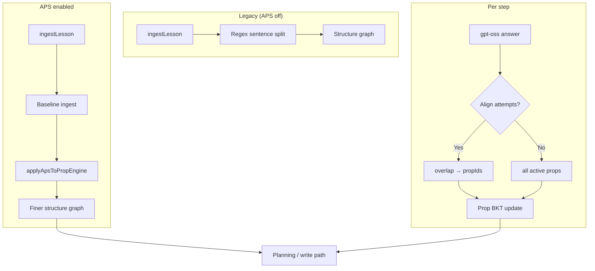

# Proposition BKT — APS Segmentation Layer

**OATutor Technical Report**  
**Version:** `prop-aps-v1`  
**Agents:** `local-llm-prop-bkt`, `local-llm-prop-chain-bkt`, `local-llm-prop-chain-tree-bkt`  
**Related:** [Planning module](./Proposition-BKT-Planning-Module-Report.md) · [Training write path](./Proposition-BKT-Training-Write-Path-Report.md)

---

## 1. Executive Summary

**APS (Abstractive Proposition Segmentation)** is an **optional** layer on Prop BKT that replaces coarse regex sentence splitting with finer **atomic propositions** at lesson ingest, and optionally aligns LLM attempts to those propositions for **selective** belief updates.

| Default | When enabled |
|---------|--------------|
| Legacy regex ingest (`extractPropositionsFromText`) | APS re-segments each step + hint pathway |
| All “active” props updated on attempt | Optional: matched props only |

**Fine-tuning is not required** to use APS in OATutor. Two built-in modes work out of the box:

| Mode | Fine-tuning? | LLM calls |
|------|--------------|-----------|
| **Heuristic APS** (default) | No | None |
| **LLM prompt APS** | No | One per step at ingest |

Fine-tuning is an **optional future** optimization for speed, cost, and math-domain quality — not a prerequisite.

---

## 2. Do we need fine-tuning?

**Short answer: No, not to start.**

### Without fine-tuning (shipped)

1. **Heuristic APS** — rule-based splits on sentences, semicolons, and discourse markers (`then`, `because`, `therefore`, …). Runs offline, instant, no GPU.
2. **LLM prompt APS** — few-shot JSON segmentation via existing **gpt-oss** at lesson ingest. Uses the same inference server as the agent; no custom model weights.

### When fine-tuning *would* help (later)

| Goal | Why fine-tune |
|------|----------------|
| **Curriculum-scale ingest** | Avoid one LLM call per step across 1,688 problems |
| **Math/LaTeX quality** | General APS models under-segment tutoring math |
| **Stable prop IDs** | Abstractive rewrites need canonical linking across paraphrases |
| **Attempt alignment** | Learned aligner beats token overlap |

Recommended path: **heuristic first → LLM prompt for ablation → fine-tune small student model (e.g. Gemma 2B) on OATutor hint/step corpus** only if prompt mode is too slow or inaccurate.

---

## 3. Architecture

APS sits **after** standard `ingestLesson` and **before** training/eval. Planning, write path, and strict no-clue behavior are unchanged when APS is off.

---

## 4. Modes

### 4.1 Heuristic APS (`heuristic`) — default when enabled

- Splits on `.!?`, semicolons, and discourse markers
- Caps at `propApsMaxPropositions` (default 12) per text block
- Rebuilds `stepPropIds`, `hintPropMap`, `answerPropId`, and structure edges
- **No fine-tuning, no LLM**

### 4.2 LLM prompt APS (`llm-prompt`)

- One structured prompt per step (step body + hints + answer)
- Expects JSON: `{ step: [], hints: {}, answer: "" }`
- Falls back to heuristic if parse fails
- **No fine-tuning** — uses deployed gpt-oss
- **Cost:** ~1 LLM call × steps in lesson at first run

### 4.3 Attempt alignment (optional checkbox)

When **Align LLM attempts to propositions** is on:

1. Segment attempt + reasoning text (heuristic)
2. Token-overlap match against step closure props
3. Pass `propIds` to `mapAttemptEvent` → **selective** BKT update

When off, behavior matches legacy (all active props on attempt).

---

## 5. Configuration

**LLM Settings → Proposition segmentation — APS**

| Setting | Key | Default |
|---------|-----|---------|
| Enable APS | `propApsEnabled` | `false` |
| Mode | `propApsMode` | `heuristic` |
| Max props per block | `propApsMaxPropositions` | `12` |
| Align attempts | `propApsAlignAttempts` | `false` |

Applies to Prop BKT, Prop Chain, and Prop Chain Tree agents. Saves immediately when the master checkbox is toggled.

---

## 6. Events

| Event | When |
|-------|------|
| `prop-aps-ingest` | After full-lesson APS pass |
| `prop-aps-step` | Per step during ingest |
| `prop-aps-attempt` | Attempt aligned to N props |

Visible in Agent Training Panel and solve traces.

---

## 7. Interaction with other modules

| Module | With APS |
|--------|----------|
| **Planning** | Reads finer graph → potentially sharper pivots |
| **Write path** | Hint→prop map may have more granular entries |
| **Strict no-clue** | Unchanged rules; beliefs may be more selective if align attempts is on |
| **Legacy Prop BKT** | Unchanged when `propApsEnabled: false` |

---

## 8. Key source files

| File | Role |
|------|------|
| `src/agent/llm/propositionSegmentation.js` | APS core |
| `src/agent/llm/propositionSegmentation.test.js` | Unit tests (`npm run test:aps`) |
| `src/agent/LocalPropositionalLLMAgent.js` | `_applyApsIfNeeded`, attempt alignment |
| `src/agent/llm/llmSettings.js` | Settings defaults |
| `src/components/agent/LLMSettingsPanel.js` | UI |

---

## 9. Limitations

1. Heuristic APS is not truly “abstractive” — it splits, does not rewrite.
2. LLM prompt mode is slow on full curriculum ingest.
3. Attempt alignment uses token overlap — paraphrases may miss.
4. Toggling APS on after training with legacy ingest re-segments; re-train for consistent beliefs.
5. Fine-tuned APS model is **not** bundled — add later as `llm-finetuned` mode if needed.

---

## 10. Summary

APS is an **opt-in segmentation layer** that improves proposition granularity and optional attempt grounding **without fine-tuning**. Use **heuristic** for daily runs; use **LLM prompt** for quality experiments; consider **fine-tuning** only when prompt mode is validated and ingest scale demands it.

*OATutor — Propositional Interpretability XAI*
