# Proposition BKT with Hint Planning Module

**OATutor Technical Report**  
**Plan version:** `hint-plan-v1`  
**Agents:** `local-llm-prop-bkt`, `local-llm-prop-chain-tree-bkt`

---

## 1. Executive Summary

**Propositional BKT (Prop BKT)** is OATutor’s proposition-level alternative to classic skill-based BKT. Instead of tracking **P(know skill)** per knowledge component, it tracks **P(know proposition)** for individual ideas extracted from step text, hints, and answers.

The **hint planning module** (`hint-plan-v1`) sits on top of trained Prop BKT beliefs and lesson structure. For each problem step it produces, **without calling an LLM**:

1. **What ideas matter** — ranked propositions in the reasoning closure  
2. **Which hints are relevant** — mapped from the training hint pathway  
3. **Distinct reasoning chains** — one scored chain per pivot idea toward the answer  

Planning is **optional** (off by default), applies only to:

| Agent | ID | Planning role |
|-------|-----|----------------|
| **Local GPT-OSS + Propositional BKT** | `local-llm-prop-bkt` | Injects plan into LLM prompt |
| **Local GPT-OSS + Prop BKT Chain Tree** | `local-llm-prop-chain-tree-bkt` | Seeds beam-tree branches from plan |

It does **not** apply to skill GPT-OSS, linear Prop Chain, Memory, RL, or cloud LLM agents.

---

## 2. Skill BKT vs Proposition BKT

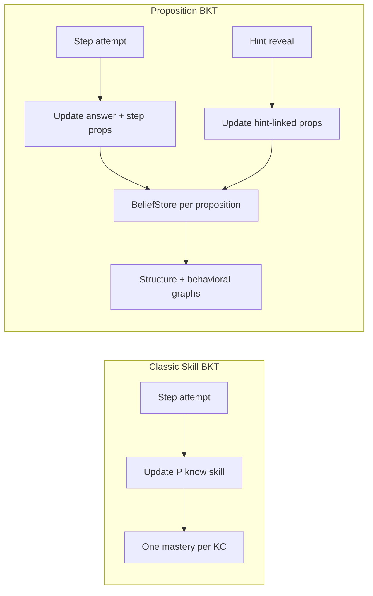

| Dimension | Skill BKT (`local-llm`) | Proposition BKT (`local-llm-prop-bkt`) |
|-----------|-------------------------|----------------------------------------|
| Unit of knowledge | Knowledge component (KC) | Individual proposition (idea) |
| Content source | Hint text list in prompt | Ranked ideas + structure |
| Graph | None (flat beliefs) | Structure graph + behavioral graph |
| Graduation | Avg KC mastery ≥ 95% | Answer propositions ≥ threshold |
| Interpretability | Low (opaque skill) | High (named ideas, chains) |

The engine lives in `@oatutor/proposition-bkt` (`proposition-bkt/`), integrated via `propositionBKTBridge.js`.

---

## 3. System Architecture

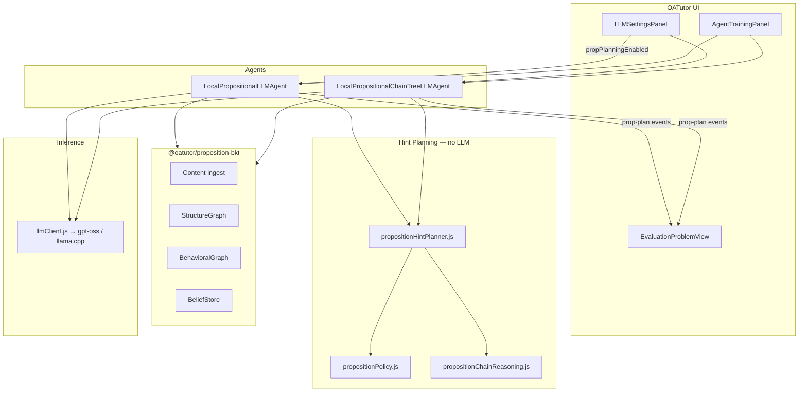

---

## 4. Content Ingestion and Structure Graph

Each lesson step is decomposed into **propositions** and **structural edges**:

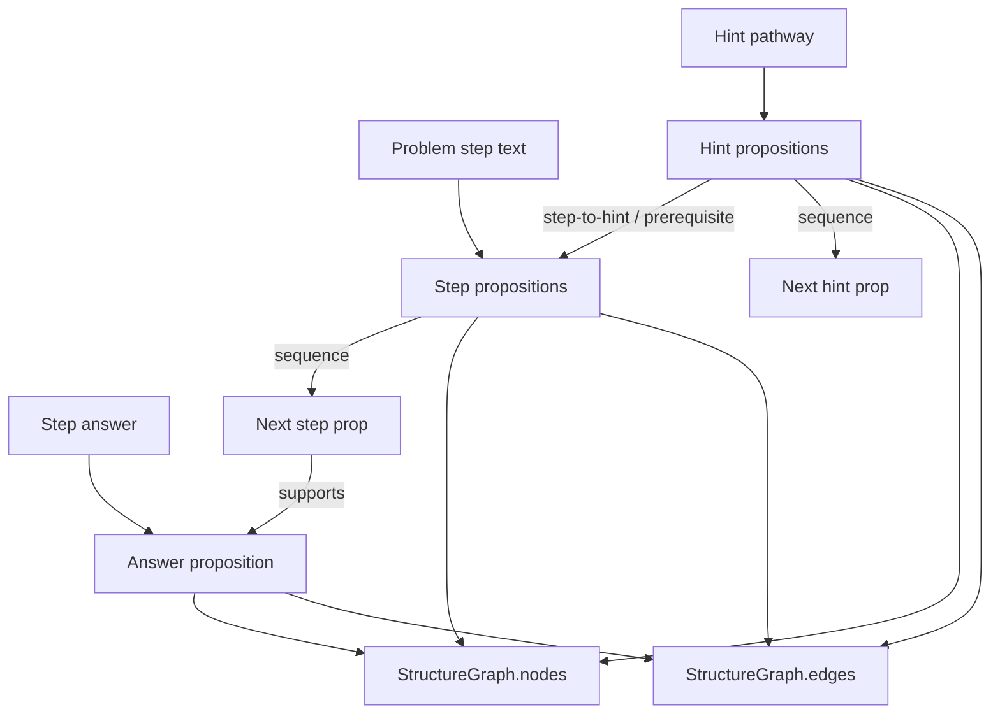

### Edge types

| Type | Role |
|------|------|
| `sequence` | Ordered ideas within step or hint pathway |
| `prerequisite`, `supports`, `depends` | Reasoning dependencies |
| `step-to-hint` | Links step ideas to hint ideas |
| `skill-link` | Proposition → KC (for KC aggregation bridge) |

### Per-step metadata (`propEngine.stepContent[stepId]`)

| Field | Purpose |
|-------|---------|
| `stepPropIds` | Propositions from step body |
| `answerPropId` | Target proposition for chains |
| `hintPropMap` | `{ hintId → [propIds] }` |
| `pathway` | Ordered hint objects from training |

---

## 5. Belief Updates (Training Phase)

During **training**, the Prop BKT agent walks problems and emits BKT events:

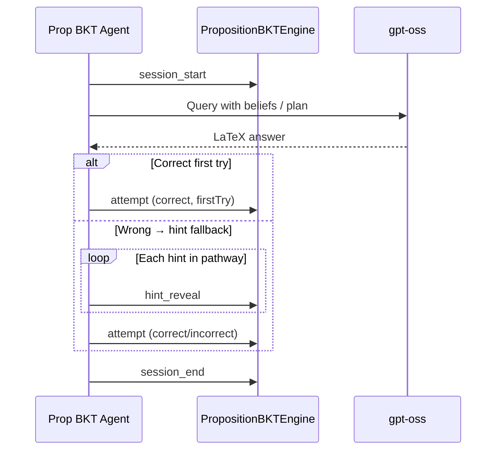

### Event types

| Event | Effect |
|-------|--------|
| `attempt` | Updates answer + supporting proposition beliefs |
| `hint_reveal` | Increases P(know) for hint-linked propositions; adds behavioral transitions |
| `session_start` / `session_end` | Bookkeeping for step sessions |

Default priors: `probMastery ≈ 0.1`, graduation threshold **95%** per proposition.

After training, the agent has a **belief state** and **structure graph** that planning reads — it does not re-read live hints during strict evaluation.

---

## 6. Prop BKT Agent — Per-Step Solve Loop

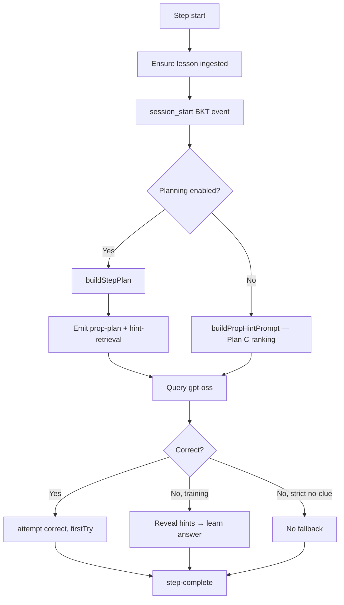

**Without planning**, the agent uses **Plan C policy** (`propositionPolicy.js`, version `plan-c-v1`): rank propositions in the prerequisite closure by **uncertainty + structural importance + source type** (hint > step > answer).

**With planning**, the flat ranking is replaced by a structured **hint plan** in the LLM prompt.

### Plan C priority formula

```
priority = 0.55 × uncertainty + 0.30 × structure + 0.15 × source − 0.5 (if mastered)
```

---

## 7. Hint Planning Module — Design

### 7.1 Motivation

In **strict no-clue evaluation**, the agent cannot read live hints. It must rely on what it learned during training. The planning module makes that knowledge explicit:

- **Pivot ideas** — distinct starting points for reasoning  
- **Relevant hints** — training hint texts tied to those ideas  
- **Candidate chains** — ordered paths from each pivot to the answer  

This is especially useful when the problem gives no scaffolding: the plan is the agent’s “memory of how to think about this step.”

### 7.2 Planning pipeline

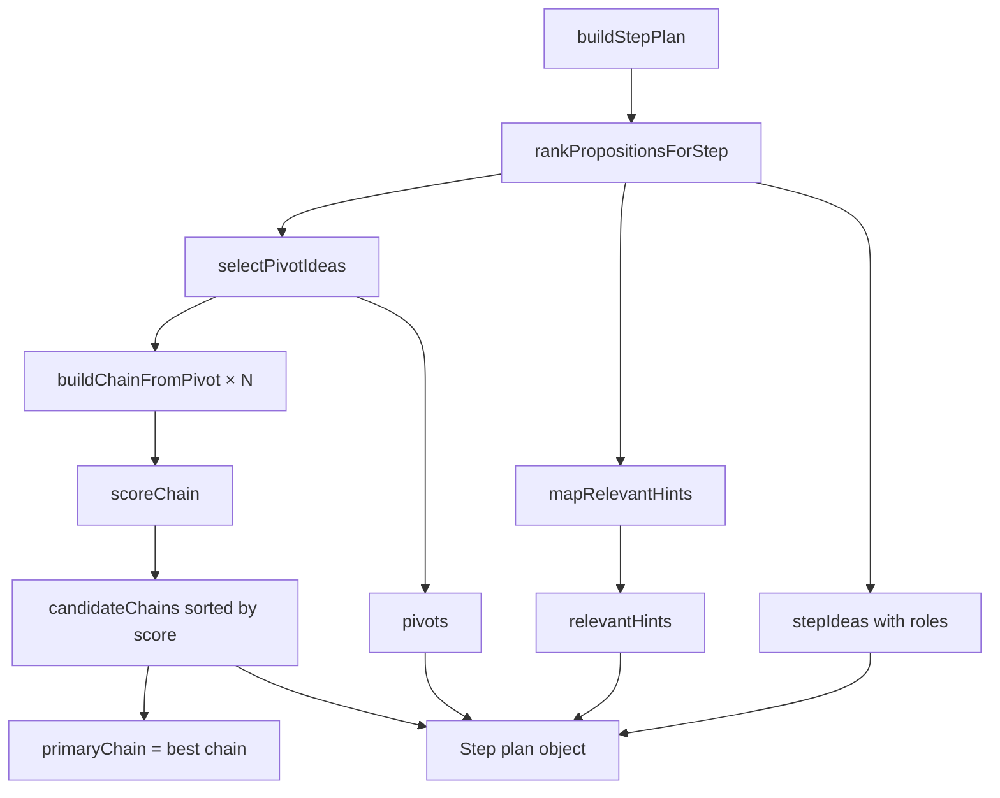

### 7.3 Plan output schema

```javascript
{
  stepId,
  lessonId,
  answerPropId,
  closureSize,
  stepIdeas:    [{ id, text, probMastery, role, priority, ... }],
  pivots:       [{ id, text, probMastery, role: "pivot", ... }],
  relevantHints:[{ hintId, propId, text, relevanceScore, probMastery }],
  candidateChains: [{ key, score, nodes, rootPropId, linkedHintIds, ... }],
  primaryChain,
  planVersion: "hint-plan-v1",
  policyVersions: { ranking: "plan-c-v1", chain: "prop-chain-v1" }
}
```

### 7.4 Pivot selection

`selectPivotIdeas` picks up to **N pivots** (default 3) from unmastered, non-answer propositions:

1. Prefer **hint-linked** propositions (they anchor training knowledge)  
2. Then other high-priority ideas from the ranking  
3. Deduplicate by proposition ID  

### 7.5 Relevant hint mapping

`mapRelevantHints` scores hints from the step’s **training pathway**:

- Links propositions → hints via `node.hintId` and `hintPropMap`  
- Scores by idea priority, uncertainty, and pivot boost  
- Returns top **M hints** (default 8) with text and P(know)  

### 7.6 Chain per pivot

`buildChainFromPivot` for each pivot:

1. Find paths in the structure graph that include the pivot and reach `answerPropId`  
2. Prefer shortest enumerated path; else BFS forward path  
3. Build proposition chain → `scoreChain` using beliefs, chain history, reasoning graph  

**Chain score** (`propositionChainReasoning.js`, `prop-chain-v1`):

```
score = 0.35 × readiness + 0.30 × history + 0.20 × graphBoost + 0.15 × urgency
```

| Component | Meaning |
|-----------|---------|
| `readiness` | Average P(know) along chain nodes |
| `history` | Chain store historical success rate |
| `graphBoost` | Reasoning graph transition support |
| `urgency` | Unmastered non-target nodes |

---

## 8. Example (Conceptual)

**Step:** Find slope through (1,2) and (3,8).

```
Pivot ideas:
  1. [42%] Slope is rise over run.
  2. [38%] Subtract y-values and x-values separately.
  3. [35%] Use the slope formula m = Δy/Δx.

Relevant hints (from training):
  1. Slope is rise over run.
  2. Subtract y-values and x-values separately.

Candidate chains:
  1. (score 0.71) Slope is rise over run → Subtract y-values… → Slope = (8−2)/(3−1)
  2. (score 0.65) Subtract y-values… → Slope = (8−2)/(3−1)
```

The LLM receives this block via `formatStepPlanForPrompt()` and must output only `$$...$$` LaTeX.

---

## 9. Integration by Agent

### 9.1 Prop BKT agent (Phase 2)

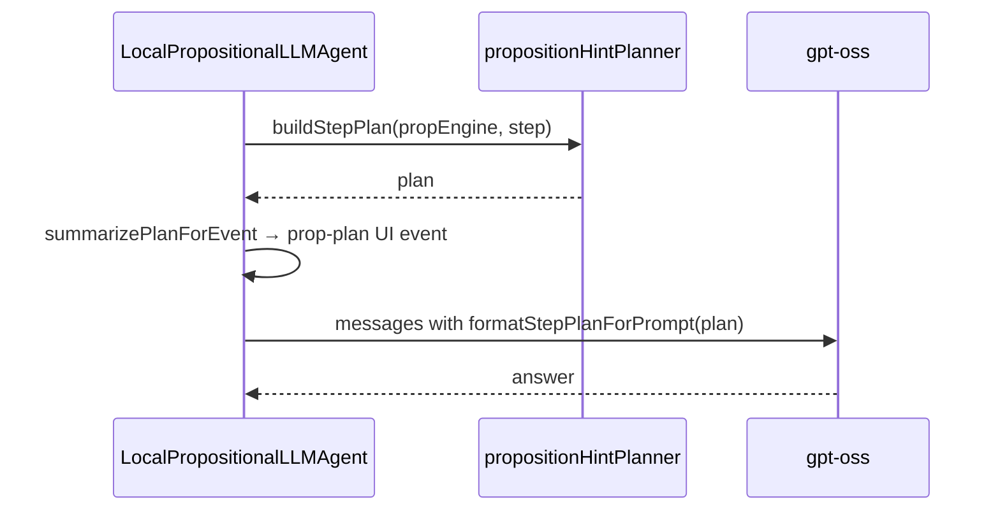

**Prompt structure (planning mode):**

- **System:** Solve without live hints; use pivot ideas, relevant hints, candidate chains  
- **User:** Hint plan block + problem/step text + “Final answer:”  

If planning fails, the agent **falls back** to standard proposition hint retrieval and logs an `llm-error` with a clear message.

### 9.2 Chain Tree agent (Phase 3)

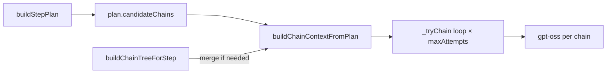

When planning is enabled:

1. Chains are **seeded from the plan** (`planSeeded: true` in tree metadata)  
2. If fewer chains than `maxAttempts`, **beam tree** branches are merged in  
3. `prop-plan` and `prop-chain-tree-candidates` events are emitted for the UI  

The linear **Prop Chain** agent (`local-llm-prop-chain-bkt`) does **not** use the planning module.

---

## 10. Configuration

### 10.1 LLM settings (`llmSettings.js`)

| Setting | Default | Description |
|---------|---------|-------------|
| `propPlanningEnabled` | `false` | Master switch |
| `propPlanningMaxPivots` | `3` | Max pivot ideas per step |
| `propPlanningMaxChains` | `5` | Max candidate chains |
| `propPlanningMaxHints` | `8` | Max relevant hints in plan |
| `propPolicyMasteryThreshold` | `0.95` | “Mastered” cutoff for ranking |
| `maxBeliefsInPrompt` | `12` | Max ideas considered in ranking |

**UI:** LLM connection settings → “Enable hint planning module” (auto-saves on toggle).

**Env overrides** (`.env`): `REACT_APP_LLM_BASE_URL`, `REACT_APP_LLM_MODEL`, etc. — these override URL/model but **not** planning flags.

### 10.2 Enabling planning — checklist

1. Provider = **Local GPT-OSS**  
2. Check **Enable hint planning module** (saves immediately)  
3. Train **Propositional BKT** or **Prop BKT Chain Tree**  
4. Confirm log line: `Hint plan: N pivot(s), M hint(s), K chain(s)`  

---

## 11. Strict No-Clue Evaluation

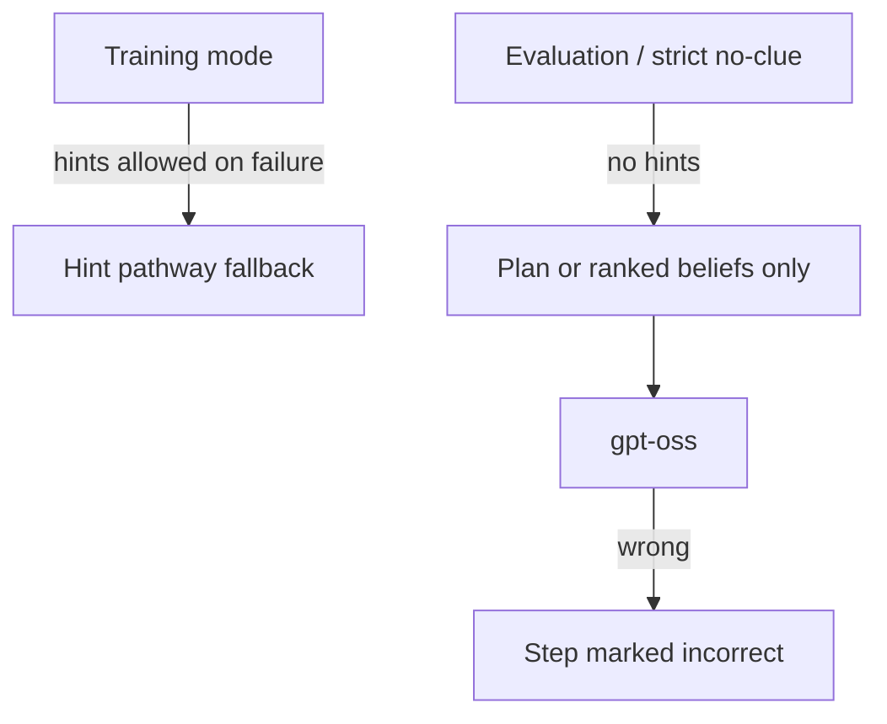

| Mode | Hint fallback | Planning value |
|------|---------------|----------------|
| Training | Yes (inflates first-try rate) | Optional; helps LLM during learning |
| Strict eval | **No** | **High** — plan is primary injected knowledge |

For honest benchmarks, use **strict no-clue evaluation** on held-out problems after training with planning enabled.

---

## 12. Observability and UI Traces

### 12.1 Event types

| Event | When | UI |
|-------|------|-----|
| `prop-plan` | Planning built per step | Training log + evaluation “Hint plan” panel |
| `hint-retrieval` | Mode = `hint-plan` or relevance/highest/lowest | Timeline label |
| `prop-policy` | Plan C ranking (planning **off**) | “Suggested focus” panel |
| `llm-response` / `llm-error` | gpt-oss result or failure | Step trace |
| `step-complete` | Final correctness | Metrics |

### 12.2 Evaluation walkthrough

`EvaluationProblemView.renderPlanPanel()` shows:

- Pivot ideas with mastery %  
- Relevant hints  
- Candidate chains with scores  

`buildSolveTrace.js` attaches `propPlan`, `hintPlanning`, and `planVersion` to each step trace.

---

## 13. Data Flow — End to End

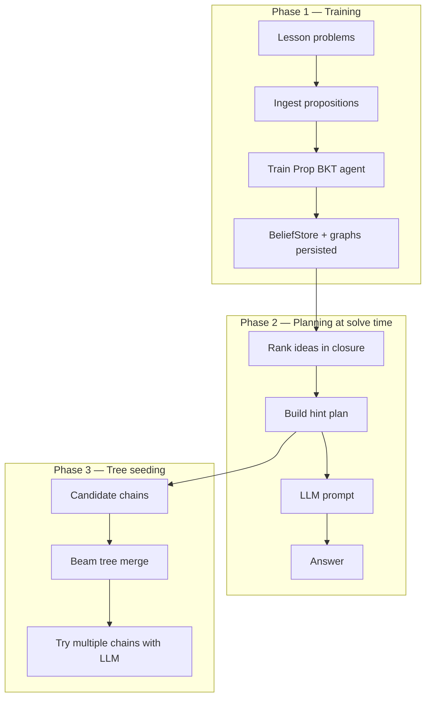

---

## 14. Key Source Files

| File | Role |
|------|------|
| `proposition-bkt/` | Standalone Prop BKT library |
| `src/agent/LocalPropositionalLLMAgent.js` | Prop BKT + planning integration |
| `src/agent/LocalPropositionalChainTreeLLMAgent.js` | Tree agent + plan seeding |
| `src/agent/llm/propositionHintPlanner.js` | Planning module (`buildStepPlan`, etc.) |
| `src/agent/llm/propositionPolicy.js` | Plan C ranking (`plan-c-v1`) |
| `src/agent/llm/propositionChainReasoning.js` | Chain build/score (`prop-chain-v1`) |
| `src/agent/llm/propositionChainTreeReasoning.js` | Beam tree (`prop-chain-tree-v1`) |
| `src/agent/llm/propositionBKTBridge.js` | OATutor ↔ proposition-bkt adapter |
| `src/agent/llm/llmSettings.js` | Planning settings |
| `src/components/agent/LLMSettingsPanel.js` | Planning UI toggle |
| `src/agent/buildSolveTrace.js` | Trace assembly for evaluation UI |
| `src/agent/llm/propositionHintPlanner.test.js` | Unit tests (`npm run test:planner`) |

---

## 15. Comparison: Prop BKT Modes

| Mode | Belief use | LLM input | Best for |
|------|------------|-----------|----------|
| **Default Prop BKT** | Plan C flat ranking | Suggested focus + ideas + anchors | General training |
| **+ Hint planning** | Plan C + structure chains | Pivot ideas + hints + chains | Strict no-clue, interpretability |
| **Prop Chain** | Chains from structure | One chain at a time | Multi-step reasoning loops |
| **Prop Tree** | Beam search branches | Best chains; plan seeds branches | Branching reasoning |

---

## 16. Limitations and Caveats

1. **Planning requires prior training** — empty beliefs → empty or weak plans.  
2. **Training hint fallback** can inflate first-try success; strict eval is the honest test.  
3. **Content-dependent** — quality depends on hint pathway richness and structure graph connectivity.  
4. **No LLM in planner** — pivots/chains are heuristic; they don’t “understand” the problem semantically.  
5. **Chain agent excluded** — linear Prop Chain ignores `propPlanningEnabled`.  
6. **gpt-oss latency** — planning lengthens prompts; rely on timeout (`REACT_APP_LLM_TIMEOUT_MS`, default 180s), not `max_tokens`.  
7. **Default off** — `propPlanningEnabled: false` in `llmSettings.js`; must be enabled explicitly.

---

## 17. Suggested Evaluation Protocol

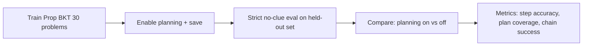

### Metrics to report

- Final / gain mastery (BKT aggregates)  
- First-try rate (note training vs eval distinction)  
- Steps with non-empty plans (pivot/hint/chain counts)  
- `prop-plan` presence in traces  
- LLM error rate (timeouts, empty reasoning)  

---

## 18. Summary

Proposition BKT gives OATutor **fine-grained, interpretable belief tracking** at the level of mathematical ideas rather than coarse skills. The **hint planning module** compiles those beliefs plus lesson structure into an explicit per-step plan: **ideas → hints → chains**, without an extra LLM call. It integrates into the **Prop BKT** agent as prompt context and into the **Chain Tree** agent as seeded branches, with full UI tracing via `prop-plan` events.

The design keeps planning **optional**, **deterministic**, and **grounded in training**, which makes it well suited for strict no-clue evaluation where the agent must reason from what it has already learned—not from live tutoring hints.

---

*OATutor — Propositional Interpretability XAI*
