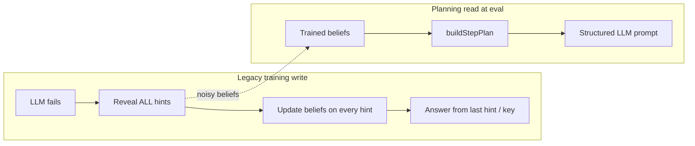
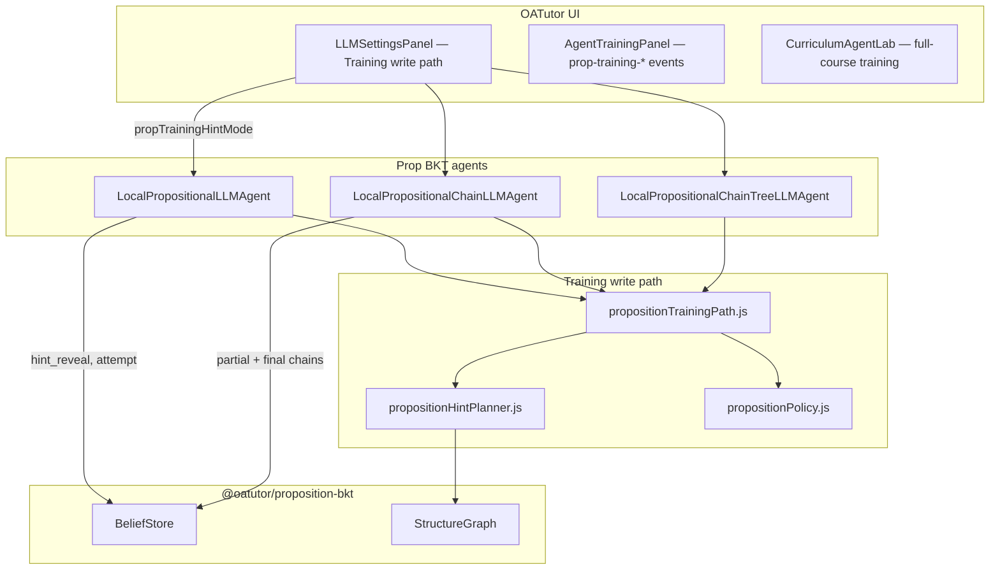
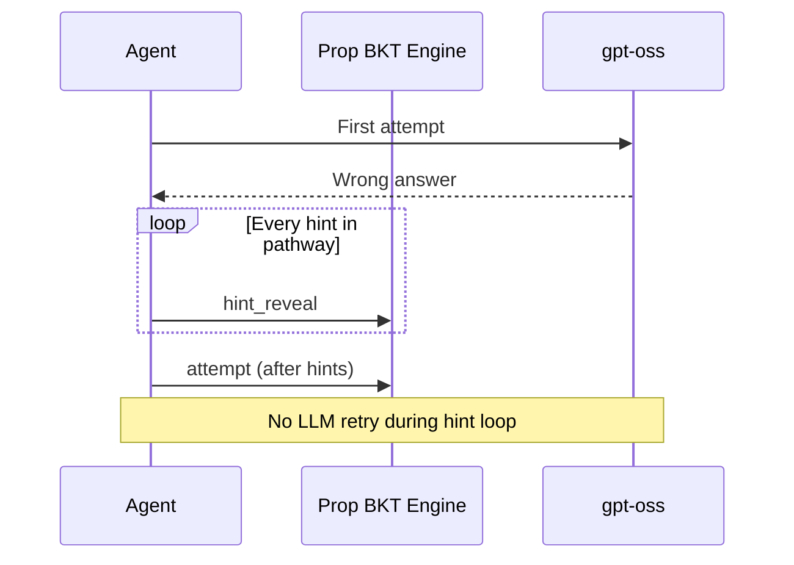
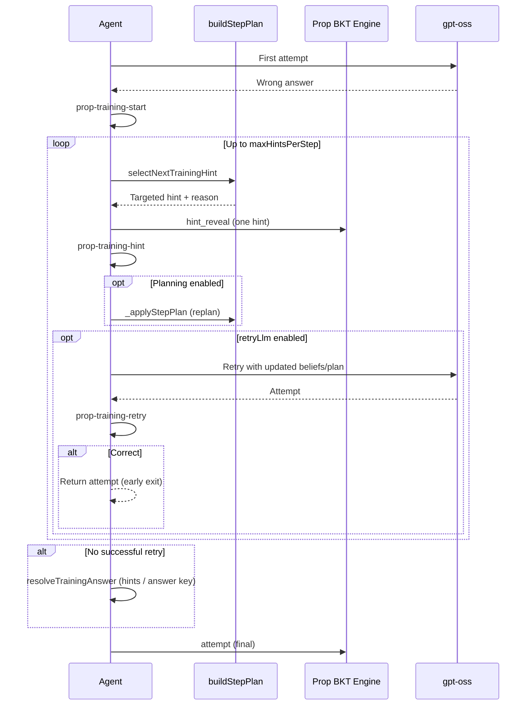
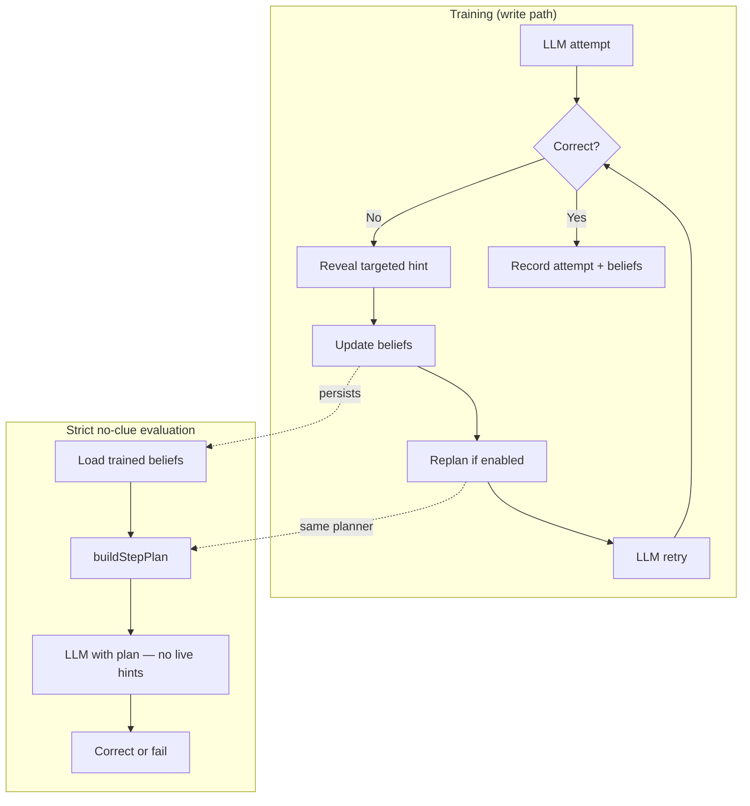

# Proposition BKT Training Write Path

**OATutor Technical Report**  
**Version:** `prop-training-write-v1`  
**Agents:** `local-llm-prop-bkt`, `local-llm-prop-chain-bkt`, `local-llm-prop-chain-tree-bkt`  
**Related:** [Proposition BKT with Hint Planning Module](./Proposition-BKT-Planning-Module-Report.md) (`hint-plan-v1`)

---

## 1. Executive Summary

The **training write path** closes a gap between how Prop BKT agents **learn** during training and how the **hint planning module reads** beliefs at solve time.

Previously, when the LLM failed a step during training, the agent revealed **every hint in pathway order** (legacy *full-pathway* mode), updated proposition beliefs on each reveal, and resolved the answer from the last hint or the step answer key — **without retrying the LLM** as beliefs changed.

The new default (**planner-guided**) reveals **one targeted hint at a time**, updates beliefs incrementally, optionally **retries the LLM** after each reveal, and stops early when the retry succeeds. Hint selection reuses the same planner signals that power strict evaluation: relevance scores, pivot ideas, and weakest chain links.

| Aspect | Legacy full-pathway | Planner-guided write path (default) |
|--------|---------------------|-------------------------------------|
| Hints revealed on failure | All, in pathway order | One at a time, planner-targeted |
| LLM retry during hint learning | No | Yes (default) |
| Belief updates | Noisy (all hints) | Focused (relevant hints first) |
| Planning loop during training | Only at step start | Re-planned after each reveal |
| Chain agent pathway memory | Full dump at once | Partial chains, finalized on success |
| Training wall time | Lower | Significantly higher |
| Strict no-clue test (expected) | Baseline | Modest improvement when beliefs were noisy |

The write path is configured in **LLM Settings → Training write path** and applies to all Prop BKT family agents during **training** (not during strict no-clue evaluation).

---

## 2. Problem Statement

### 2.1 The read/write asymmetry

The hint planning module (`hint-plan-v1`) is a **read path**: at solve time it reads trained beliefs and structure to propose pivot ideas, relevant hints, and reasoning chains — without calling an LLM.

Before this update, training used a **blunt write path**:



Problems with the legacy approach:

1. **Irrelevant hint reveals** update proposition beliefs even when only one or two ideas were weak.
2. **No LLM retry** after targeted learning — the agent never practices “updated beliefs → replan → try again.”
3. **Chain agents** recorded one full pathway dump, misaligned with planner pivots.
4. **Strict no-clue evaluation** suffers because beliefs reflect pathway order, not reasoning gaps.

### 2.2 Design goal

Make training **write** the same kind of structured knowledge that planning **reads**:

> fail → targeted hint → belief update → replan → LLM retry → (repeat or succeed)

This mirrors the evaluation loop where the agent must reason from beliefs and plan alone.

---

## 3. Architecture



### Module boundary

| Module | Role |
|--------|------|
| `propositionTrainingPath.js` | Hint selection, answer resolution, mode resolution |
| `LocalPropositionalLLMAgent.js` | `_learnFromHintsWritePath`, training event emission |
| `LocalPropositionalChainLLMAgent.js` | Partial chain recording hooks |
| `propositionHintPlanner.js` | `buildStepPlan`, relevance / pivot signals (shared with planning) |
| `llmSettings.js` | Defaults and persisted settings |

---

## 4. Training Hint Reveal Modes

Three modes are available via `propTrainingHintMode`:

| Mode | ID | Behavior |
|------|-----|----------|
| **Planner-guided** (default) | `planner-guided` | Select next hint by planner relevance → pivot → weakest chain link → fallback |
| **Partial sequential** | `partial-sequential` | Reveal one hint at a time in pathway order; optional LLM retry |
| **Full pathway (legacy)** | `full-pathway` | Reveal all hints at once; original behavior |

### 4.1 Legacy full-pathway



### 4.2 Planner-guided write path



---

## 5. Hint Selection Algorithm (`selectNextTrainingHint`)

Implemented in `propositionTrainingPath.js`. Selection runs only for `planner-guided` and `partial-sequential` modes.

### 5.1 Planner-guided priority chain

For each unrevealed hint in the step pathway:

| Priority | Reason code | Source |
|----------|-------------|--------|
| 1 | `planner-relevance` | `plan.relevantHints` — hints scored by proposition relevance |
| 2 | `pivot-hint` | `plan.pivots` with direct `hintId` |
| 3 | `weakest-chain-link` | Lowest-mastery non-target node on primary chain with a pathway hint |
| 4 | `pivot-hint-map` | Pivot idea mapped via `hintPropMap` |
| 5 | `pathway-fallback` | First unrevealed hint in pathway order |

Each selection returns metadata used in traces:

```javascript
{
  hint, pathwayIndex,
  reason,           // e.g. "planner-relevance"
  propId,           // linked proposition (if any)
  relevanceScore,   // from mapRelevantHints
  probMastery,      // belief at selection time
  trainingMode      // "planner-guided"
}
```

### 5.2 Partial sequential

Always picks the first unrevealed hint in pathway order (`reason: "pathway-order"`). Useful as an ablation baseline between legacy dump and full planner targeting.

### 5.3 Answer resolution (`resolveTrainingAnswer`)

After partial reveals, if no LLM retry succeeded:

1. Walk revealed hints **in reverse order**; return first `hintAnswer` or sub-hint answer found.
2. If `propTrainingAllowAnswerKey !== false` (default **true**), fall back to `step.stepAnswer[0]`.
3. If answer key disabled and no hint answer exists, return `null`.

---

## 6. Agent Integration

### 6.1 LocalPropositionalLLMAgent

Entry point: `_learnFromHints` branches on `isFullPathwayTrainingMode(settings)`:

- **Legacy** → `_learnFromHintsFullPathway`
- **Write path** → `_learnFromHintsWritePath`

Key behaviors in `_learnFromHintsWritePath`:

| Step | Action |
|------|--------|
| Start | Emit `prop-training-start` with `trainingPathVersion`, mode, pathway length |
| Per hint | `_revealTrainingHint` → BKT `hint_reveal` event; emit `prop-training-hint` |
| After reveal | If planning enabled: `_applyStepPlan(step, settings)` |
| Retry | `_queryLLM` → emit `prop-training-retry`; exit early on correct |
| Complete | `_onTrainingPathwayComplete` hook; return attempt or resolved answer |

The outer `_solveStep` loop is unchanged: first LLM attempt → on failure call `_learnFromHints` → record final correctness.

### 6.2 LocalPropositionalChainLLMAgent

Overrides training hooks to record **incremental** reasoning chains:

| Hook | Behavior |
|------|----------|
| `_onTrainingHintRevealed` | `chainFromHintPathway` on partial revealed set; `finalize: false` |
| `_onTrainingPathwayComplete` | Finalize chain; `chainStore.rememberStepChain`; emit `prop-chain-learned` |

Chain source labels:

- `hint-pathway-partial` — during incremental reveals
- `hint-pathway-complete` — on step success

This aligns chain memory with the hints the planner actually chose, not the full ordered dump.

### 6.3 Chain Tree agent

Inherits write-path behavior through `LocalPropositionalLLMAgent`. Tree-specific seeding at evaluation time is unchanged; training benefits from cleaner beliefs and partial chain structure.

---

## 7. Configuration

Settings are persisted in browser storage via `llmSettings.js` and exposed in **LLM Settings → Training write path**.

| Setting | Key | Default | Description |
|---------|-----|---------|-------------|
| Training hint reveal | `propTrainingHintMode` | `planner-guided` | Mode selector |
| Max hints per step | `propTrainingMaxHintsPerStep` | `8` | Cap on partial reveal loop |
| Retry LLM after hint | `propTrainingRetryLlm` | `true` | Query gpt-oss after each reveal |
| Allow answer key fallback | `propTrainingAllowAnswerKey` | `true` | Use `stepAnswer` if hints lack answer |

### Recommended configurations

| Goal | Settings |
|------|----------|
| **Best strict-eval alignment** | `planner-guided` + planning enabled + `retryLlm: true` |
| **Faster training (ablation)** | `partial-sequential` + `retryLlm: false` |
| **Legacy baseline** | `full-pathway` |
| **Harder training (no answer key)** | `planner-guided` + `allowAnswerKey: false` |

Planning checkbox (`propPlanningEnabled`) is independent but **synergistic**: when enabled, `_applyStepPlan` runs after each training hint reveal, keeping the training replan loop aligned with evaluation.

---

## 8. Observability and Events

### 8.1 New event types

| Event | When | Key fields |
|-------|------|------------|
| `prop-training-start` | Write path begins on failed step | `trainingMode`, `trainingPathVersion`, `pathwayLength`, `retryLlm` |
| `prop-training-hint` | Each targeted reveal | `hintId`, `reason`, `hintsRevealedTotal`, `propId`, `relevanceScore` |
| `prop-training-retry` | After each LLM retry | `attempt`, `isCorrect`, `hintsRevealed` |

### 8.2 UI surfaces

| Surface | Content |
|---------|---------|
| `AgentTrainingPanel` | Live log lines for write-path events |
| `buildSolveTrace.js` | Human-readable trace strings per step |
| `EvaluationProblemView` | Indirect — better beliefs → richer `prop-plan` at eval |

### 8.3 Interpreting `reason` codes

During a curriculum or lesson training run, a healthy planner-guided session should show a mix of:

- `planner-relevance` and `pivot-hint` — planner steering working
- `weakest-chain-link` — chain-aware targeting
- `pathway-fallback` — planner had no better match (acceptable occasionally)

If nearly all reveals are `pathway-fallback`, beliefs may be empty (insufficient prior training) or the step lacks hint–proposition links in the structure graph.

---

## 9. Training vs Evaluation Alignment



The write path does **not** change strict evaluation rules: live hints remain disabled. It improves the **quality of persisted beliefs** that planning consumes.

---

## 10. Performance Expectations

This section documents **expected directional effects**, not benchmark guarantees. Validate on your course split with A/B runs (legacy vs planner-guided).

### 10.1 What should improve

| Dimension | Mechanism | Expected effect |
|-----------|-----------|-----------------|
| **Proposition belief quality** | Targeted `hint_reveal` events | Sharper pivots; fewer irrelevant mastered props |
| **Relevant hints at eval** | `mapRelevantHints` reads cleaner beliefs | Better hint anchors in strict prompt |
| **Chain agent memory** | Partial chains match planner reveals | Chains reflect actual gaps, not dump order |
| **Strict no-clue accuracy** | Better beliefs + plan alignment | **Modest** gain on held-out test set |
| **Interpretability** | `prop-training-hint` reason codes | Visible link between weakness and reveal |

### 10.2 What will likely worsen or change

| Dimension | Mechanism | Expected effect |
|-----------|-----------|-----------------|
| **Training wall time** | Up to N LLM calls per failed step (N ≤ `maxHintsPerStep`) | **Several× longer** on LLM-heavy courses |
| **Curriculum completion** | Longer jobs, more timeout risk | More checkpoint pauses (e.g. 23/24 lesson jobs) |
| **LLM load** | Retries on gpt-oss host | Higher inference server utilization |
| **Training first-try rate** | Unchanged on first LLM path | Still high if model often succeeds first |
| **Training step correctness** | Answer key fallback still default | Remains high — **not** a good proxy for write-path value |

### 10.3 What strict no-clue gains to expect

| Scenario | Expected strict-eval change |
|----------|----------------------------|
| Steps with long hint pathways (5+ hints) | Larger gain — legacy dumped all |
| Steps with good hint–prop structure | Moderate gain |
| Short pathways, LLM already strong | Small or negligible gain |
| Planning disabled during training | Reduced synergy; partial-sequential still helps beliefs |
| `allowAnswerKey: false` | Harder training; potentially better beliefs but lower training completion |

**Rule of thumb:** judge the write path on **strict no-clue held-out accuracy** and **plan quality in traces**, not on training completion percentage.

---

## 11. Benchmark Methodology

### 11.1 Fair A/B comparison

Run both configurations on the **same curriculum split** (same `holdout-ratio`, seed, agents):

| Run | `propTrainingHintMode` | Planning | Eval |
|-----|------------------------|----------|------|
| **A — Baseline** | `full-pathway` | on/off (match B) | Strict no-clue test |
| **B — Write path** | `planner-guided` | same as A | Strict no-clue test |

Hold constant: `localBaseUrl`, model, `propTrainingMaxHintsPerStep`, timeout settings.

### 11.2 Metrics to record

| Metric | Source | Notes |
|--------|--------|-------|
| Strict test accuracy | Curriculum report `testEvaluation` | Primary outcome |
| First-try rate (eval) | Per-step `step-complete.firstTry` | Secondary |
| Mean proposition mastery | Agent backup / belief export | Should be more selective |
| Hints revealed per step | `prop-training-hint` count | Should decrease vs full dump |
| LLM calls per step | `llm-response` + `prop-training-retry` | Will increase |
| Training duration | Wall clock per lesson job | Will increase |
| Reveal reason distribution | `prop-training-hint.reason` | Planner steering diagnostic |

### 11.3 Unit tests

```bash
npm run test:training-path   # propositionTrainingPath.js (5 tests)
npm run test:planner         # propositionHintPlanner.js (10 tests)
```

---

## 12. Curriculum Pipeline Interaction

Full-course training (`CurriculumAgentLab`) runs the same `_solveStep` → `_learnFromHints` path per problem. Implications:

1. **Longer lesson jobs** — write path multiplies LLM calls on failed steps across hundreds of problems per lesson.
2. **Checkpoint pauses** — if training stops before all lesson jobs complete (e.g. 23/24), the pipeline intentionally pauses before the test phase. This is orchestrator behavior, not a write-path bug.
3. **Resume** — checkpoint resumes skip completed lesson jobs; the remaining job runs with current write-path settings.
4. **Test-only runs** — `Run Test Set Only` uses persisted agent state; write path affects test results only through beliefs already written during training.

---

## 13. Comparison with Hint Planning Module

| Concern | Planning module (`hint-plan-v1`) | Training write path (`prop-training-write-v1`) |
|---------|----------------------------------|-----------------------------------------------|
| Phase | Solve time (read) | Training time (write) |
| Calls LLM | No (deterministic) | Yes (retries) |
| Uses beliefs | Reads | Writes via `hint_reveal` |
| Default | Off (checkbox) | On (`planner-guided`) |
| Agents | Prop BKT, Chain Tree | Prop BKT, Chain, Chain Tree |

**Best results:** enable **both** — planning provides the read path at eval; the write path ensures training updates beliefs in a planner-aligned way.

---

## 14. Key Source Files

| File | Role |
|------|------|
| `src/agent/llm/propositionTrainingPath.js` | Selection, resolution, mode constants |
| `src/agent/llm/propositionTrainingPath.test.js` | Unit tests |
| `src/agent/LocalPropositionalLLMAgent.js` | `_learnFromHintsWritePath`, event emission |
| `src/agent/LocalPropositionalChainLLMAgent.js` | Partial chain hooks |
| `src/agent/llm/propositionHintPlanner.js` | Shared planner (`buildStepPlan`) |
| `src/agent/llm/llmSettings.js` | Settings defaults |
| `src/components/agent/LLMSettingsPanel.js` | Training write path UI |
| `src/components/agent/AgentTrainingPanel.js` | Event log formatting |
| `src/agent/buildSolveTrace.js` | Evaluation trace strings |
| `src/agent/CrossLessonOrchestrator.js` | Full-course train/test pipeline |

---

## 15. Limitations and Caveats

1. **Answer key fallback** — default `propTrainingAllowAnswerKey: true` can still inflate mastery when the LLM never succeeds but the step is marked correct via the key.
2. **LLM cost and latency** — `retryLlm: true` is the main training time multiplier; disable for quick smoke tests only.
3. **Empty beliefs early in training** — planner-guided selection degrades to `pathway-fallback` until enough `hint_reveal` / `attempt` events exist.
4. **maxHintsPerStep cap** — steps may exhaust the cap without LLM success; final answer falls back to `resolveTrainingAnswer`.
5. **Planning optional** — write path works without planning enabled, but loses replan-after-reveal synergy.
6. **Not evaluated on skill BKT** — `local-llm` (skill-based) agents use a separate hint pathway; this report applies only to the Prop BKT family.
7. **No automatic PDF export** — this report is markdown-only; use the planning report PDF script pattern if PDF is needed later.

---

## 16. Summary

The training write path (`prop-training-write-v1`) replaces the legacy “dump all hints” training fallback with a **planner-aligned, incremental reveal loop** that updates proposition beliefs selectively and retries the LLM as knowledge accumulates.

| Stakeholder question | Answer |
|---------------------|--------|
| Will training finish faster? | **No** — expect longer runs. |
| Will training accuracy look better? | **Not necessarily** — answer key still rescues failures. |
| Will strict no-clue test improve? | **Likely modest improvement** when beliefs were previously noisy. |
| What should I enable? | `planner-guided` + hint planning + strict no-clue eval on held-out set. |
| How do I verify it is working? | Inspect `prop-training-hint` events for `planner-relevance` / `pivot-hint` reasons. |

The design goal is **belief–plan alignment**: training should write the same structured knowledge that the hint planning module reads during strict evaluation — making Prop BKT a coherent read/write system rather than a plan-on-noisy-beliefs patch.

---

*Report generated for OATutor Prop BKT training write path (`prop-training-write-v1`). For planning module details, see [Proposition-BKT-Planning-Module-Report.md](./Proposition-BKT-Planning-Module-Report.md).*
