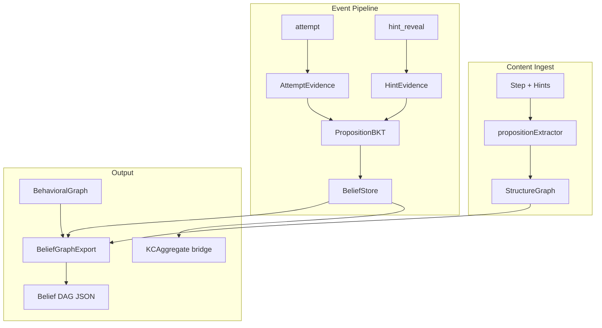

# @oatutor/proposition-bkt

Proposition-centric Bayesian Knowledge Tracing (BKT) — a standalone JavaScript library that tracks **P(know proposition)** instead of **P(know skill)**, designed as a parallel alternative to OATutor's KC-based BKT.

**Zero dependency on OATutor runtime code.** OATutor integration is optional and future via a thin adapter.

## Architecture



## Quick Start

```bash
npm test
npm run demo
node examples/run-demo.mjs --fixture test/fixtures/one-step-three-hints.json --export out/belief-graph.json
```

```javascript
import { createPropositionBKTEngine } from "@oatutor/proposition-bkt";

const engine = createPropositionBKTEngine({
  defaultBelief: { probMastery: 0.1, probSlip: 0.1, probGuess: 0.1, probTransit: 0.1 },
  masteryThreshold: 0.95,
  hintEvidenceWeight: 0.5,
  firstTryOnly: true,
});

engine.ingestLesson({ lessonId, problems, skillModel });
engine.processEvent({ type: "attempt", stepId, problemId, correct: false, firstTry: true });
engine.processEvent({ type: "hint_reveal", stepId, hintId, pathwayIndex: 0 });
engine.getBeliefs();
engine.getBeliefGraph(lessonId);
engine.getKCAggregates();
engine.toJSON();
```

## Worked Example

**Step:** “Find the slope of the line through (1,2) and (3,8).”

| Hint | Text |
|------|------|
| Hint 1 | Slope is rise over run. |
| Hint 2 | Subtract y-values and x-values separately. |
| Hint 3 | Slope = (8−2)/(3−1). |

**Event sequence → expected belief shifts:**

| Event | Effect |
|-------|--------|
| Wrong attempt | ↓ answer prop; step props slightly ↓ |
| Hint 1 revealed | ↑ prop: “Slope is rise over run.” |
| Hint 2 revealed | ↑ prop: “Subtract y-values…”; behavioral edge hint1→hint2 |
| Correct attempt | ↑ answer prop; ↑ supporting chain |

**Export:** Belief DAG JSON with node `probMastery` values and behavioral `P(to\|from)` on the path hint1→hint2→answer.

Run the demo to see live output:

```bash
node examples/run-demo.mjs --fixture test/fixtures/one-step-three-hints.json
```

## Public API

| Method | Description |
|--------|-------------|
| `createPropositionBKTEngine(config)` | Initialize engine |
| `engine.ingestLesson({ lessonId, problems, skillModel })` | Extract propositions, build structure graph |
| `engine.processEvent(event)` | Process `attempt`, `hint_reveal`, `session_start`, `session_end` |
| `engine.getBeliefs()` | `{ [propId]: BeliefModel }` |
| `engine.getBeliefGraph(lessonId)` | Merged structure + beliefs + behavior |
| `engine.getKCAggregates()` | Optional `{ [kc]: P(know) }` via noisy-OR |
| `engine.selectNextProblem({ lessonId, candidateProblemIds })` | Weakest-closure selection |
| `engine.checkGraduation()` | All answer props ≥ threshold |
| `engine.toJSON()` / `PropositionBKTEngine.fromJSON(data)` | Persistence |
| `exportBeliefGraphJSON(engine, { lessonId })` | JSON-safe export |

## Core Schemas

### Proposition

```json
{
  "id": "prop-a1b2c3",
  "text": "The slope is the change in y over the change in x.",
  "sourceType": "hint",
  "stepId": "step-123",
  "problemId": "prob-456",
  "hintId": "hint-2",
  "hintIndex": 1,
  "skills": ["linear_slope"]
}
```

### Belief Model (per proposition)

Same 4 parameters as classic BKT. **Only `probMastery` is updated during learning** (OATutor convention):

```json
{ "probMastery": 0.1, "probSlip": 0.1, "probGuess": 0.1, "probTransit": 0.1 }
```

### Interaction Event

```json
{ "type": "attempt", "stepId": "step-123", "problemId": "prob-456", "correct": false, "firstTry": true }
{ "type": "hint_reveal", "stepId": "step-123", "hintId": "hint-2", "pathwayIndex": 1 }
```

### Belief Graph Export

```json
{
  "lessonId": "lesson-1",
  "nodes": [{ "id": "prop-a", "text": "...", "probMastery": 0.72, "role": "hint" }],
  "structuralEdges": [{ "from": "prop-a", "to": "prop-b", "type": "supports" }],
  "behavioralEdges": [{ "from": "prop-a", "to": "prop-b", "count": 5, "probability": 0.62 }],
  "beliefSummary": { "mastered": [], "uncertain": [], "bottlenecks": [] }
}
```

## Design Decisions

| Question | Decision | Default |
|----------|----------|---------|
| **Granularity** | One proposition per sentence (min ~8 chars) | Sentence-level |
| **Equivalence** | Same math, different wording → same ID when source context matches | Stable hash with `sourceId` |
| **Contradiction** | Explicit `contradicts` edges when hint paths diverge | Only for competing pathways |
| **Cold start** | Uniform prior per proposition | `probMastery = 0.1` |
| **Student vs agent** | `firstTryOnly` config | `true` (student); `false` (agent) |
| **Hint weight** | Weighted BKT pass, weaker than attempts | `hintEvidenceWeight = 0.5` |

## KC Bridge (Optional)

For comparison with legacy BKT only — not the primary belief store:

```
P(know KC) = 1 - Π (1 - P(know prop))   // noisy-OR (default)
P(know KC) = min({ P(know prop) : prop ∈ KC })   // min strategy
```

Configure via `kcAggregateStrategy: "noisy-or" | "min"`.

## Migration Phases

1. **Instrument only** — ingest content, export belief graph
2. **Dual update** — run in parallel with KC-BKT for comparison
3. **Hint-as-evidence** — wire hint reveals
4. **Proposition-driven selection** — CLI demo + `selectNextProblem`
5. **OATutor adapter** — `bridge/OATutorAdapter.js` (sketch included, not wired)

## Repository Structure

```
proposition-bkt/
  src/
    core/          PropositionBKT, BeliefStore, BeliefModel
    graph/         StructureGraph, BehavioralGraph, BeliefGraphExport
    evidence/      AttemptEvidence, HintEvidence, EvidenceMapper
    extract/       propositionExtractor, contentIngest
    bridge/        KCAggregate, OATutorAdapter (future)
    selection/     propositionProblemSelect, graduation
  test/fixtures/   one-step-three-hints, multi-hint-wrong-then-correct
  examples/        run-demo.mjs CLI
```

## Non-Goals (v1)

- No React UI
- No modifications to OATutor
- No LLM fine-tuning
- No answer checking — accepts `correct: boolean` as input
- No Firebase/browser storage — in-memory + JSON file only

## License

MIT
